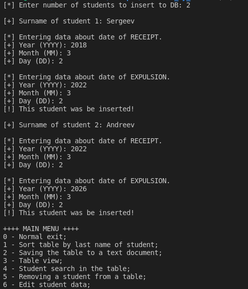
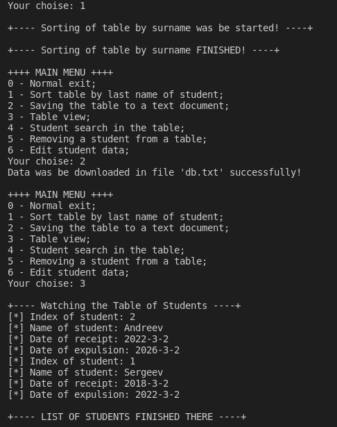

# CM0dul3s

+--- ./database\_by\_structs/third\_task.cpp ---+

<b>ru:</b> Определить структурированный тип и набор  функций для работы с таблицей записей, 
реализованной в массиве структур. В перечень функций входят: 
<ul>
<li>ввод записи таблицы с клавиатуры;</li>
<li>Загрузка и сохранение  таблицы в текстовом файле;</li>
<li>Просмотр таблицы;</li>
<li>сортировка таблицы в порядке возрастания заданного поля;</li>
<li>поиск в таблице элемента с заданным значением поля или с наиболее близким к нему по значению;</li>
<li>удаление записи;</li>
<li>изменение (редактирование) записи;</li>
<li>вычисление с проверкой и использованием всех pfgbctq по заданному условию и формуле  (например, общая сумма на всех счетах).</li>
</ul>
 

№9: Фамилия, дата поступления, дата отчисления.
 
<b>en:</b> Define a structured type and a set of functions for working with a table of records, 
implemented in an array of structures. The list of functions includes: 
<ul>
<li>Entering a table entry from the keyboard;</li>
<li>Load and save table in a text file;</li>
<li>View table;</li>
<li>sort the table in ascending order of the specified field;</li>
<li>search in the table for an element with a given field value or with the closest value to it;</li>
<li>remove entry;</li>
<li>changing (editing) an entry;</li>
<li>calculation that checks and uses all pfgbctq according to a given condition and formula  (for example, the total amount on all accounts).</li>
</ul>
 

No. 9: Surname, date of receipt, date of expulsion.
 
					Enjoy
+----------------------------------------------+
 
<b>Example:</b> 
</img> 
</img> 
 