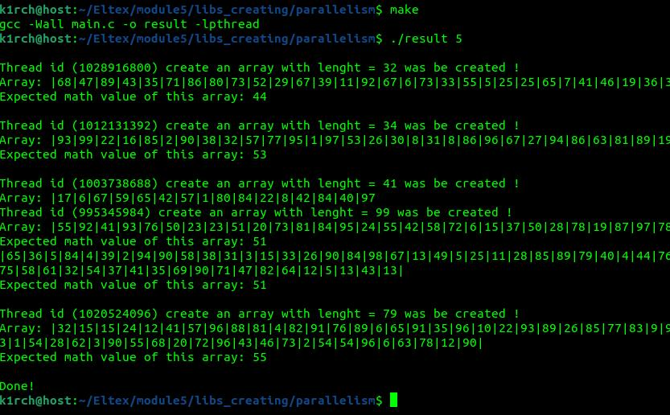

# LIBS CREATING
 
+---- ./libs_creating/parallelism/main.c ----+
 
Description: The args parameter controls the number of threads to process - hence the number of arrays to process 
Usage: 
$ make 
$ ./result your_number_here (ex.: 5) 
 
</img> 
 
+---- Enjoy ----+ 

